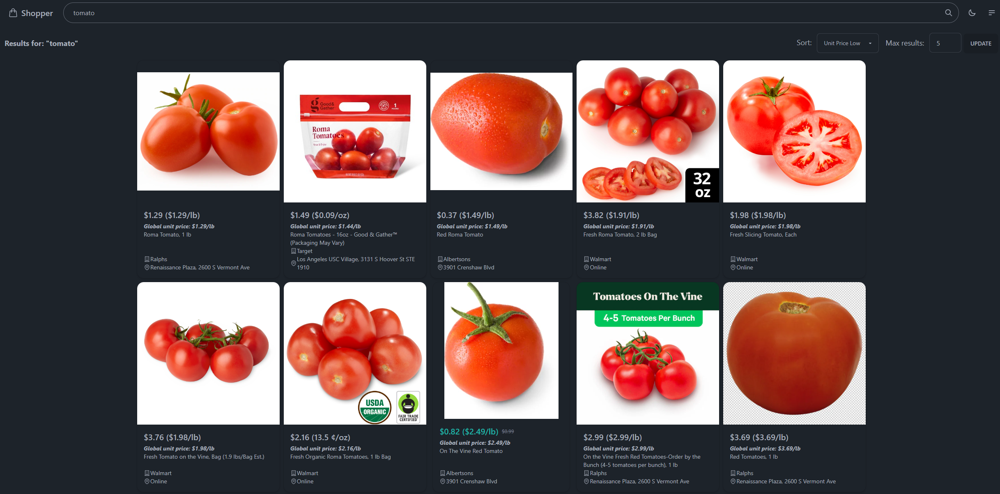

# Shopper

## [Link to app](https://shop.jackzhang.me/)

One-stop solution for comparing grocery prices across different merchants.

Front-end is built with [Svelte](https://svelte.dev/) and [Tailwind CSS](https://tailwindcss.com/).

### Usage

Search for a product and see the prices across different merchants. Apply any filters or sorting as preferred.

### Supported Merchants
- [x] Walmart
- [x] Target
- [x] Kroger
  - Ralphs, Food 4 Less, etc.
- [x] Albertsons
  - Vons, Safeway, Pavillions, etc.

### Screenshots

